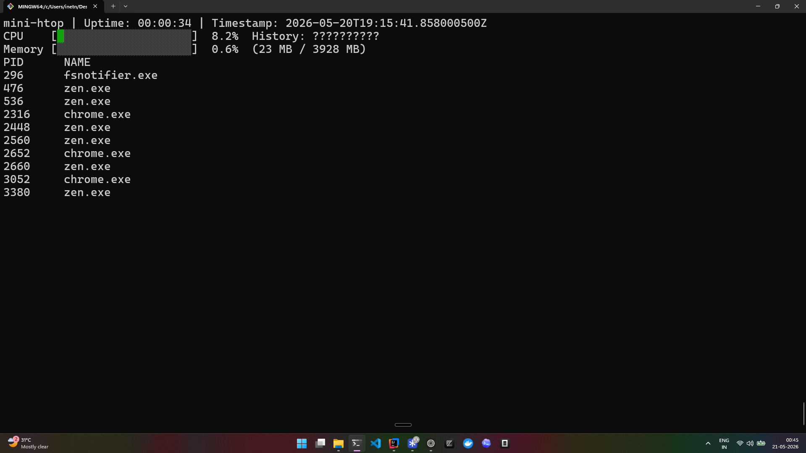

# mini-htop

A terminal system monitor written in Java. Shows live CPU usage, memory,
and running processes — refreshing every second.



## Run

```bash
java -jar mini-htop.jar
```

Requires Java 17+.

## Build from source

```bash
mvn clean package
java -jar target/mini-htop-1.0-SNAPSHOT.jar
```

## What's inside

- CPU usage with sparkline history
- Heap memory usage
- Top 10 running processes
- Configurable via `config.json`